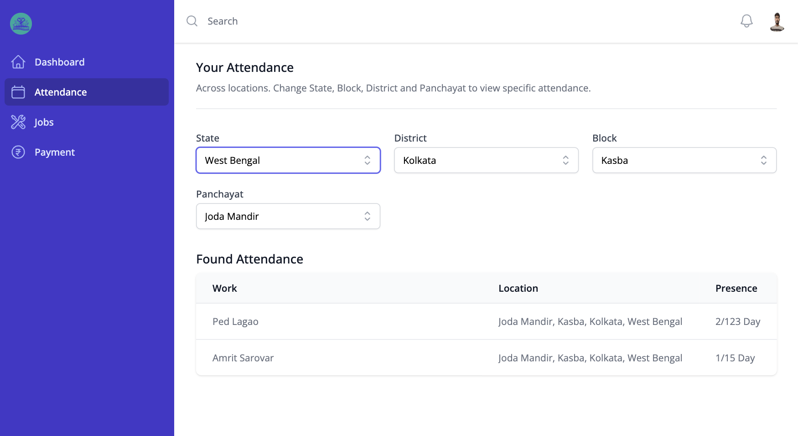

# NREGA 2.0

The government of India has a scheme named "Mahatma Gandhi National Rural Employment Guarantee Act, 2005" in short 'MGNREGA' which guarantees of providing atleast 100 days of employment to every household in the rural areas. The worker does unskilled jobs in exchange with fixed daily wages. The central government has a system to manage it through a web portal.

## Issues with existing platform

1. Job completion may be questioned.
2. Attendance of worker may not reflect real data. Can be taken from home.
3. Worker allotment to job is on Sachiv's hand. It may cause single point of failure and raise chance of corruption.
4. The Transparency for worker is negligible.
5. User interface is untidy, irresponsive and inconsistent. The same goes with user experience.

## Solution, The redefined platform.

## Features

### Admin Panel

- Manage workers with creation, updation, deletion, and selection options.
- Progress of works, addition of workers and work detail modification.
- Attendance of worker with authentication with UIDAI and Location Co-ordinates.
- Payment to worker directly with on server algorithm to detect attendance and Direct Benefit Transfer.

  
***a view of Admin Panel***

### Worker Panel

- Apply for job in Gram Panchayat.
- Check attendance for specific location, job, and date.
- Status of last payment and other payments for specific job.
- Progress on current enrolled job.
 
  
***a view of Worker Panel***